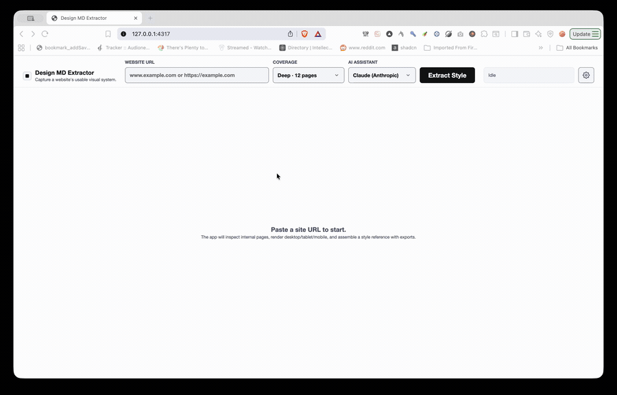

# Design MD Extractor

Capture a website's **usable visual system** — colors, typography, spacing, radii, shadows, surfaces, and components — and turn it into a structured `DESIGN.md`, ready-to-use design tokens, and AI-ready prompts.

Point it at a URL. It loads the site in a real browser across desktop, tablet, and mobile, reads computed styles, ranks the evidence into confident tokens, and writes everything to disk. Use it from the **CLI**, a **local GUI**, or an **MCP server** so any AI agent can call it directly.

> Fully local. It never calls an AI or needs an API key — the "AI Assistant" picker only chooses which prompt template you copy into your own agent.



## What you get

Every run produces:

| File | What it is |
|---|---|
| `DESIGN.md` | Human + LLM readable style reference (thesis, tokens, guidelines) |
| `evidence.json` | Full structured, schema-validated evidence (source of truth) |
| `tokens.css` | CSS custom properties (`:root { --color-… }`) |
| `preview.html` | Standalone visual preview of the extracted system |
| `screenshots/` | Desktop / tablet / mobile captures |

The GUI and MCP server also offer on-demand exports:

| Export | Format |
|---|---|
| Style variables | CSS custom properties |
| Tailwind theme | Tailwind v4 `@theme` block |
| Design tokens | JSON |
| AI prompt | Prompt tailored to Codex / Claude / ChatGPT / generic |

## How it works

```
URL
 └─ discover internal pages (separate browser pass)
     └─ load each page × viewport (Playwright) and settle
         └─ collect evidence in-page (computed colors, type, components)
             └─ normalize + dedupe + rank into confident tokens (Zod-validated)
                 └─ write DESIGN.md, tokens, preview, screenshots
```

Confidence is frequency-based: a token seen often is `high`, rarely is `low`.

## Requirements

- Node.js ≥ 18.18
- Playwright's Chromium: `npx playwright install chromium`

## Install

```bash
git clone https://github.com/jpoindexter/design-md-extractor.git
cd design-md-extractor
npm install
npx playwright install chromium
npm run build
```

## Usage

### GUI

```bash
npm run dev
# open http://127.0.0.1:4317
```

Paste a URL, hit **Extract Style**, and browse the result: color palette, type scale, spacing, components, and copy/download for each export format (or the whole bundle as a `.zip`).

### CLI

```bash
node dist/cli.js extract https://example.com --out ./out/example
```

Outputs land in the `--out` directory.

### MCP Server

The MCP server exposes the full extraction pipeline as tools so any MCP-compatible AI agent can call it — no GUI, no shell commands.

```bash
npm run mcp
```

Or run the compiled binary directly (useful in MCP config files):

```bash
node /absolute/path/to/design-md-extractor/dist/mcp.js
```

#### Tools

| Tool | Description |
|---|---|
| `extract_design` | Extract the design system from a URL. Returns the full `DESIGN.md` inline plus a structured summary. Artifacts are written to disk. |
| `list_runs` | List previously completed extractions, sorted newest first. |
| `get_run` | Retrieve the `DESIGN.md` and summary for a past run by `runId`. |

**`extract_design` input:**

| Parameter | Type | Default | Description |
|---|---|---|---|
| `url` | `string` (URL) | required | Website to extract |
| `maxPages` | `integer` 1–12 | `5` | Max pages to crawl |

**`extract_design` response includes:**

- `runId` — unique identifier for this run
- `url` — canonical URL extracted
- `outDir` — absolute path to all artifacts on disk
- `discoveredPages` — pages that were crawled
- `summary` — structured data: colors, typography, spacing, radii, shadows, surfaces, components, warnings, style thesis
- `designMd` — full `DESIGN.md` content, ready to pass to an LLM

#### Wire it into Claude Code

Add to `.claude/settings.json` (project) or `~/.claude/settings.json` (global):

```json
{
  "mcpServers": {
    "design-md-extractor": {
      "command": "node",
      "args": ["/absolute/path/to/design-md-extractor/dist/mcp.js"]
    }
  }
}
```

#### Wire it into Cursor / other MCP clients

```json
{
  "mcpServers": {
    "design-md-extractor": {
      "command": "node",
      "args": ["/absolute/path/to/design-md-extractor/dist/mcp.js"]
    }
  }
}
```

#### Custom artifacts directory

By default, runs are stored at `<package-root>/out/gui-runs/`. Override with the `DESIGN_MD_RUNS_DIR` environment variable:

```bash
DESIGN_MD_RUNS_DIR=/tmp/my-runs node dist/mcp.js
```

Or in your MCP config:

```json
{
  "mcpServers": {
    "design-md-extractor": {
      "command": "node",
      "args": ["/absolute/path/to/design-md-extractor/dist/mcp.js"],
      "env": {
        "DESIGN_MD_RUNS_DIR": "/path/to/shared/runs"
      }
    }
  }
}
```

## Bypassing Cloudflare and login walls

Sites behind Cloudflare or a login wall serve a challenge page to a fresh browser. Two ways to reuse your real session:

### Cookie file (non-interactive)
Export your cookies from a browser where the site already loads (DevTools → Application → Cookies, or a "Get cookies.txt" / EditThisCookie extension) and copy your browser's User-Agent (`navigator.userAgent` in the console):

```bash
node dist/cli.js extract https://site.com \
  --cookies ./cookies.json \
  --user-agent "Mozilla/5.0 ..." \
  --out ./out/site
```

Cloudflare binds `cf_clearance` to the IP **and** User-Agent that solved the challenge. The extractor runs on your machine (same IP), so a matching `--user-agent` is required for the cookies to validate. Cookie files (Playwright JSON or Netscape `cookies.txt`) are accepted.

### Persistent Chrome profile (most reliable)
Opens a real, visible Chrome window with an on-disk profile. Clear the challenge / log in once; the session persists and is reused on later runs:

```bash
node dist/cli.js extract https://site.com --profile ./.chrome-profile --out ./out/site
```

The first run is interactive (a window opens — solve the challenge); re-running the same command reuses the profile until the session expires. Requires Google Chrome installed; this mode runs **headed** (a visible window) because headless browsers are detectable.

## Use with an AI coding agent (Claude Code skill)

This repo ships a Claude Code skill in [`skill/`](skill/SKILL.md) so an agent can consume a `DESIGN.md` and rebuild or extend a site's styles faithfully. Point your agent at `skill/SKILL.md` and the generated `DESIGN.md`.

The MCP server and the skill work well together: use `extract_design` to generate the `DESIGN.md`, then use the skill to guide implementation.

## Development

```bash
npm run build        # tsc → dist/
npm run dev          # build + launch GUI at http://127.0.0.1:4317
npm run mcp          # build + start MCP server (stdio)
npm test             # vitest (unit + integration)
npm run lint         # eslint
npm run format       # prettier
npm run check        # build + lint + test (pre-merge gate)

# unit tests only (fast; no browser)
npx vitest run tests/unit/
```

Integration tests launch a real Playwright browser and are slower than the unit suite.

## Project layout

```
src/cli.ts         CLI entry point
src/gui.ts         GUI server entry point
src/mcp.ts         MCP server entry point
src/config/        CLI arg parsing, viewport presets
src/crawl/         browser lifecycle, page loading, discovery, orchestration
src/extract/       collectPageEvidence — runs inside the browser (page.evaluate)
src/evidence/      Zod schema, normalization/ranking, confidence
src/generate/      DESIGN.md, preview HTML, CSS generators
src/io/            artifact writing, path safety
src/gui/           local HTTP server + inline SPA shell
skill/             Claude Code skill + references
docs/              architecture, schema, and system notes
```

See [`docs/architecture`](docs/architecture) and [`docs/schema`](docs/schema) for deeper reference.

## License

[MIT](LICENSE) © Jason Poindexter
