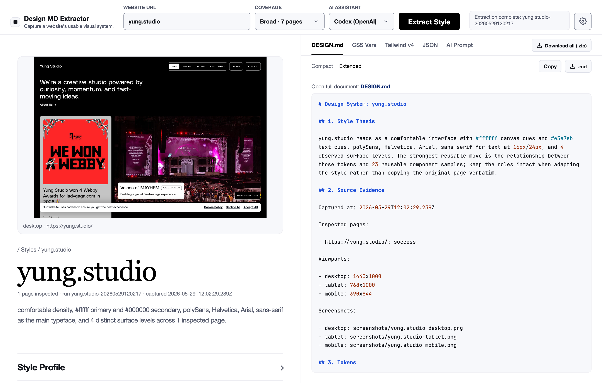

# Design MD Extractor

Capture a website's **usable visual system** — colors, typography, spacing, radii, shadows, surfaces, and components — and turn it into a structured `DESIGN.md`, ready-to-use design tokens, and AI-ready prompts.

Point it at a URL. It loads the site in a real browser across desktop/tablet/mobile, reads computed styles, ranks the evidence into confident tokens, and writes everything to disk. Use it from the **CLI** or a **local GUI**.

> Fully local. It never calls an AI or needs an API key — the "AI Assistant" picker only chooses which prompt template you copy into your own agent.



## What you get

Every run produces:

| File | What it is |
|---|---|
| `DESIGN.md` | Human + LLM readable style reference (thesis, tokens, guidelines) |
| `evidence.json` | The full structured, schema-validated evidence (source of truth) |
| `style-variables.css` | CSS custom properties (`:root { --color-… }`) |
| `tailwind-theme.css` | Tailwind v4 `@theme` block |
| `design-tokens.json` | Tokens as JSON |
| `ai-prompt.txt` | A prompt tailored to your assistant (Codex / Claude / ChatGPT / generic) |
| `preview.html` | A standalone visual preview of the extracted system |
| `screenshots/` | Desktop / tablet / mobile captures |

## How it works

```
URL
 └─ discover internal pages (separate browser pass)
     └─ load each page × viewport (Playwright) and settle
         └─ collect evidence in-page (computed colors, type, components)
             └─ normalize + dedupe + rank into confident tokens (Zod-validated)
                 └─ write DESIGN.md, tokens, preview, screenshots
```

Confidence is frequency-based: a token seen often is `high`, rarely is `low`.

## Requirements

- Node.js ≥ 18.18
- Playwright's Chromium: `npx playwright install chromium`

## Install

```bash
git clone https://github.com/jpoindexter/design-md-extractor.git
cd design-md-extractor
npm install
npx playwright install chromium
npm run build
```

## Usage

### GUI (recommended)

```bash
npm run gui
# open http://127.0.0.1:4317
```

Paste a URL, hit **Extract Style**, and browse the result: color palette, type scale, components, and copy/download for each export format (or the whole bundle as a `.zip`).

### CLI

```bash
node dist/cli.js extract https://example.com --out ./out/example
```

Outputs land in the `--out` directory.

## Use with an AI coding agent (Claude Code skill)

This repo ships a Claude Code skill in [`skill/`](skill/SKILL.md) so an agent can consume a `DESIGN.md` and rebuild or extend the style faithfully. Point your agent at `skill/SKILL.md` and the generated `DESIGN.md`.

## Development

```bash
npm run build        # tsc → dist/
npm run gui          # build + launch the GUI
npm test             # vitest (unit + integration)
npm run lint         # eslint
npm run format       # prettier
npm run check        # build + lint + test (pre-merge gate)

# unit tests only (fast; no browser)
npx vitest run tests/unit/
```

Integration tests launch a real Playwright browser, so they're slower than the unit suite.

## Project layout

```
src/config/    CLI arg parsing, viewport presets
src/crawl/     browser lifecycle, page loading, discovery, orchestration
src/extract/   collectPageEvidence — runs inside the browser (page.evaluate)
src/evidence/  Zod schema, normalization/ranking, confidence
src/generate/  DESIGN.md, preview HTML, CSS generators
src/io/        artifact writing, path safety
src/gui/       local HTTP server + inline SPA shell
skill/         Claude Code skill + references
docs/          architecture, schema, and system notes
```

See [`docs/architecture`](docs/architecture) and [`docs/schema`](docs/schema) for deeper reference.

## License

[MIT](LICENSE) © Jason Poindexter
